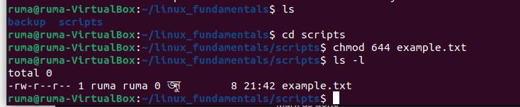

# linux command guidline


# Table of content:
1. [File System Navigation](#List)

- List the contents of the home directory.
- Change the current directory to /var/log and list its contents.
- Find and display the path to the bash executable using the which command.
- Find current shell.

 2. [File and Directory Operations](#Create)
- Create a directory named linux_fundamentals in your home directory.
- Inside linux_fundamentals, create a subdirectory named scripts.
- Create an empty file named example.txt inside the linux_fundamentals directory.
- Copy example.txt to the scripts directory.
- Move example.txt from linux_fundamentals to linux_fundamentals/backup

3. [Permissions](#Permissions)
- Change the permissions of example.txt to read and write for the owner, and read-only for the group and others.
- Verify the permission changes using ls -l
  
4. [File Modification](#Numeric-Permissions)
- Create a file named example.txt in your home directory.
- Change the owner of example.txt to a user named student.
- Change the group of example.txt to a group named students.
- Verify the changes using appropriate commands.


## List
- 'ls': The command to list directory contents.
- '~': The shorthand symbol for the current user's home directory.


## Change the Directory
- Change the current directory to /var/log and list its contents.
- The 'cd' command stands for "change directory.
- For example, cd /path/to/directory will change the current directory to /path/to/directory.
  ```bash
  cd /var/log
  ```


## Find and display
- The 'which' command is used to locate the executable file associated with a given command.
- 'which bash' will display the path to the bash executable.

## echo $SHELL
- The 'echo' command is used to display a line of text or the value of a variable.
- '$SHELL' is an environment variable that stores the path of the default shell for the current user.
- 'echo $SHELL' will print the path of the user's default shell.
  ```bash
  which bash
  echo $SHELL
  ```


## Create a Directory
- The 'mkdir' command in Unix-based systems is used to create new directories. 
- This command creates a directory named directory_name in the current working directory.
- The 'mkdir' command with the '-p' option allows you to create parent directories as needed.
``` bash
  mkdir directory_name
  mkdir -p parent/child/grandchild
```


## Create a File
-The touch command is used to create an empty file or update the access and modification timestamps of an existing file.


- The 'cp' command is used to copy files and directories.


## move file
- The 'mv' command is used to move or rename files and directories.
- The 'ls' command with the '-l' option lists directory contents in long format, providing detailed information such as permissions, number of links, owner, group, size, and modification time.


## Permissions

- This command creates a new group named devops_group_1 using administrative privileges.
- 'sudo' allows you to run commands with superuser privileges.
- 'groupadd' is the command to add a new group.
- 'devops_group_1' is the name of the new group being created.
- 'getent' is used to query these databases.
- 'group' specifies that you want to query the group database.
- 'cat' is used to concatenate and display file content.
- '/etc/group' is the file that contains group information.
  ```bash
  sudo groupadd devops_group_1
  getent group devops_group_1
  cat /etc/groupcat /etc/group | grep devops_group_1
  ```


## Numeric-Permissions

- 'chmod': The command used to change the file mode (permissions).
- '644': The numeric representation of the permissions you want to set.
  
## Permissions Set by 'chmod 644'
- 6 (Owner): Read (4) + Write (2) = rw-
- 4 (Group): Read (4) = r--
- 4 (Others): Read (4) = r--



- The chmod 644 command is used to change the permissions of a file or directory in Unix-based systems.
- https://github.com/Roja-Islam/Practice.git
- git@github.com:Roja-Islam/Practice.git

